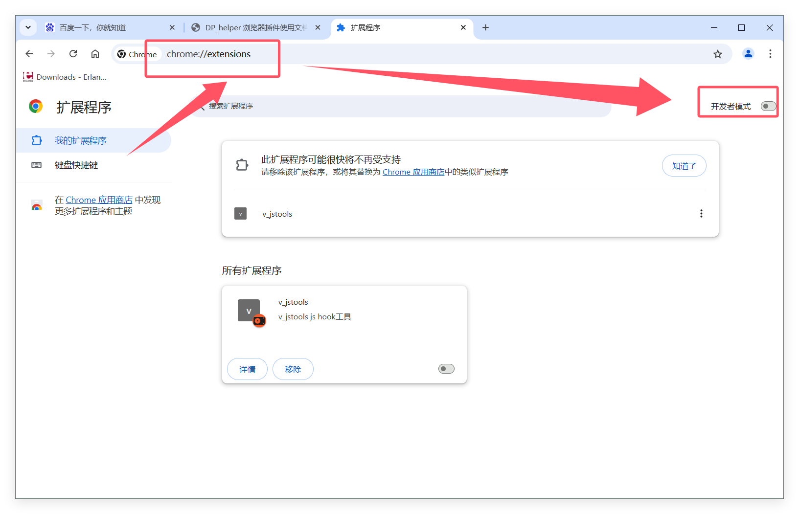
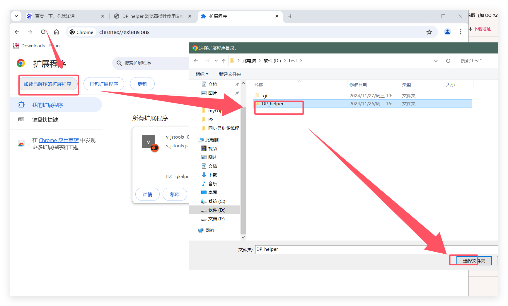
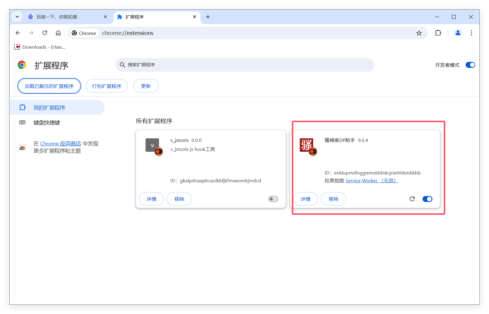
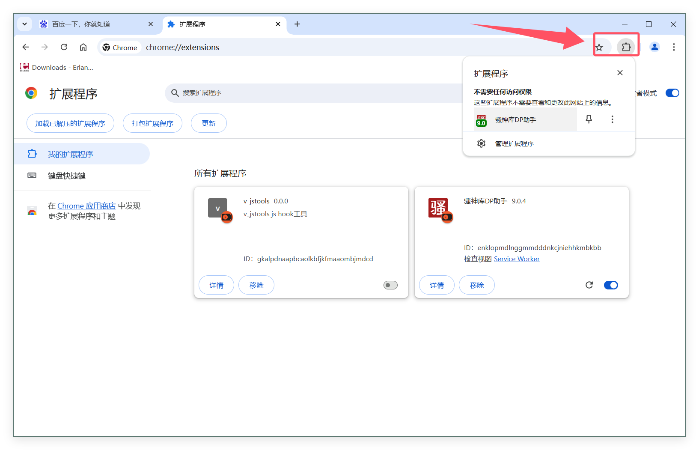

#  😈 下载安装

## 下载方法

### 最新版本为vip版本

- #### 1.  VIP版本9.5  获取（加 QQ ***1227141324*** 获取）（一次购买 永久使用 后续版本免费获取）（大约一杯星巴克的费用）(不支持旧谷歌浏览器)（支持MAC系统 Linux Windows10）

- #### 2.  免费版7.9版本  [下载地址](https://github.com/wxhzhwxhzh/saossion_code_helper_online/releases/download/7.9/DP_helper_7.9.rar/)

---
## 安装方法

####  👻 一 打开谷歌浏览器  
- 在地址栏 输入   chrome://extensions/ 并打开开发者模式
    
     
-  

---
#### 👻 二 点击加载 
-   选择插件目录
    
  
-  

---
#### 👻 安装成功
-   安装成功后，重启一下浏览器，即可使用
    
    
-  
-  
 

