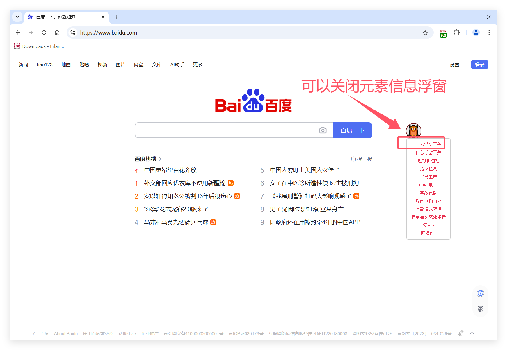

#  😈 基本用法

---
1. ### 👻 用法一  
    
   - #### 按F8 生成*完整dp定位语法*     
   -  

---
1. ### 👻 用法二 
    
   - #### 按F2 自动生成 *精简dp定位语法*     
 
   -  
---

1. ### 👻 用法三 
    
   - #### 按alt+2  自动生成  ***坐标定位语法***     
 
   -  
---

1. ### 👻 用法四
    
   - #### 按 F9  捕捉当前鼠标处元素  ***选择自定义语法***     
 
   -  
 
  ---
5. ### 👻 其他功能
    
   - #### 鼠标移动到猫头鹰图标上  有更多功能
   - 例如 关闭信息浮窗 指纹检测 复制 cookie 等功能   
 
   -  

