#  😈 高阶用法

## 🦆打开
### 打开devtools  打开控制台  按F12  选择元素  即可使用

1.  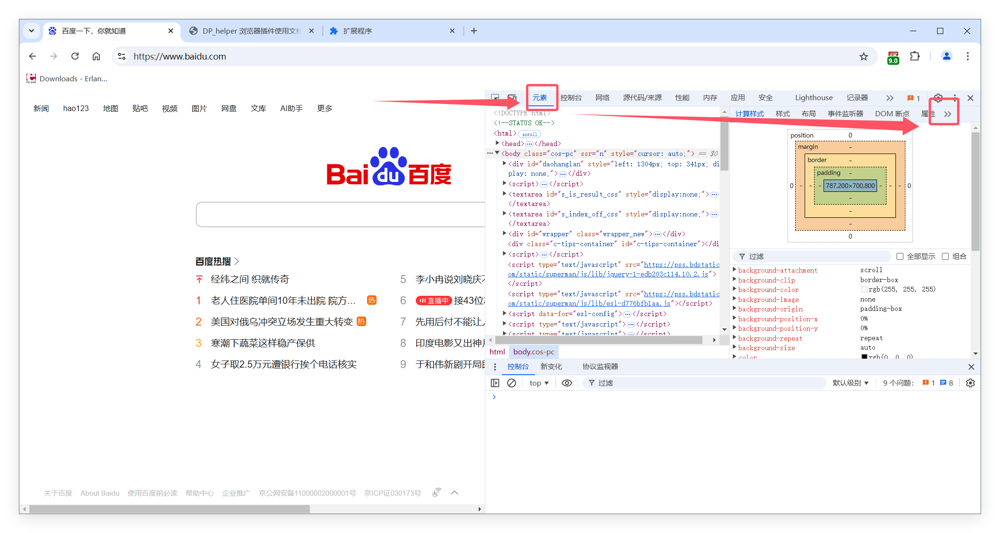 

2.  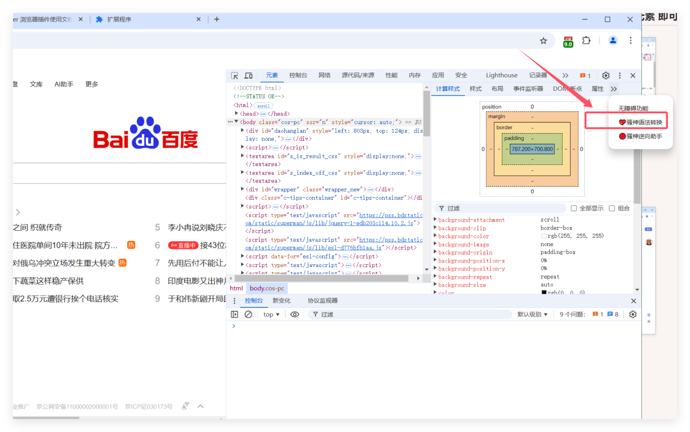 

---

##  🦆 用法一 解析  
- 选中元素面板任意元素，自动生成语法
    
     
- 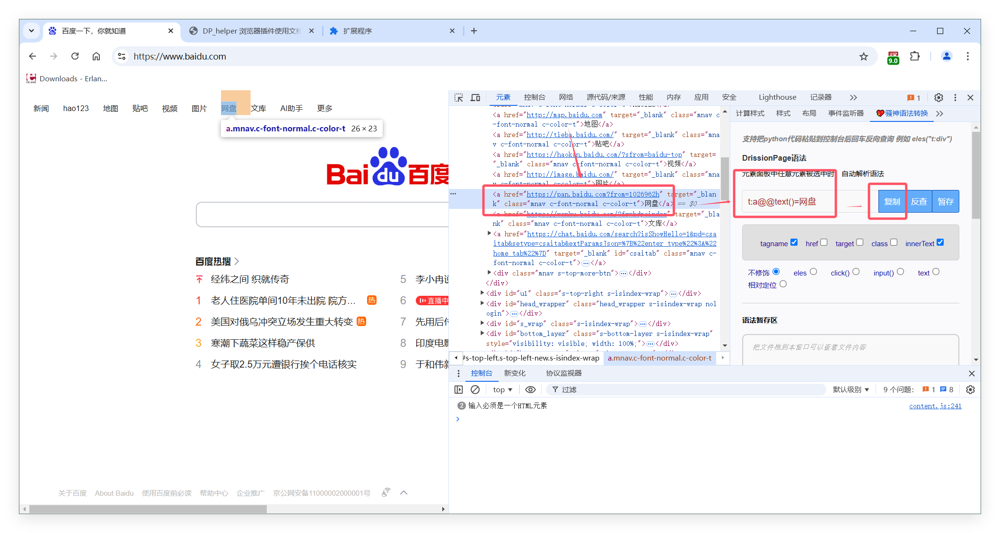 

---
## 🦆 用法二 反查 
-   点击 反查按钮  校验元素是否正确，是否有重复元素，是否有多个元素 
    
  
- 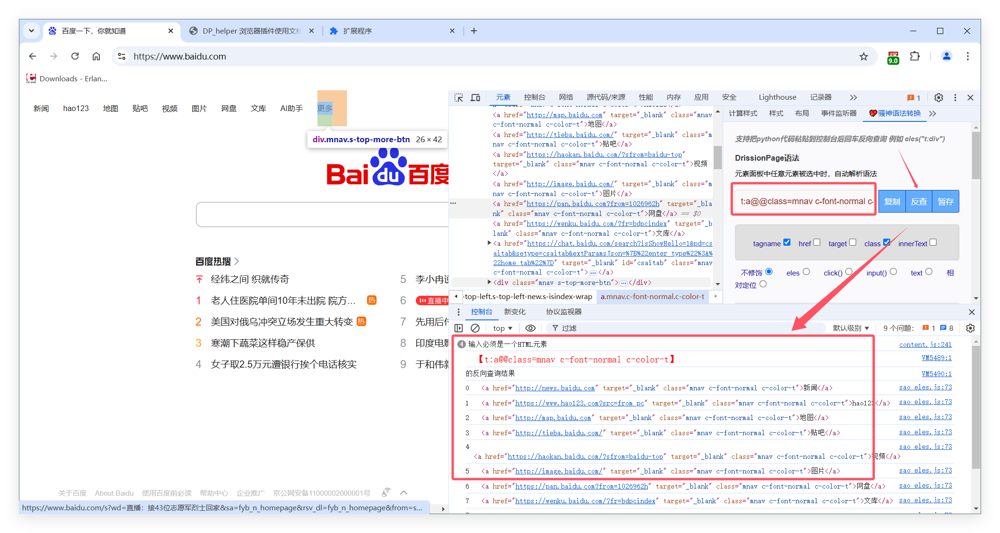 

---
## 🦆 用法三 暂存
-   点击 暂存按钮  可以把检查的元素保存起来，累计保存多个元素定位语法 ，最后批量获取整个页面所有所需元素的定位语法
    
    
- 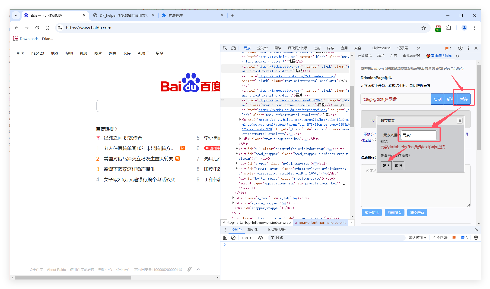 
- 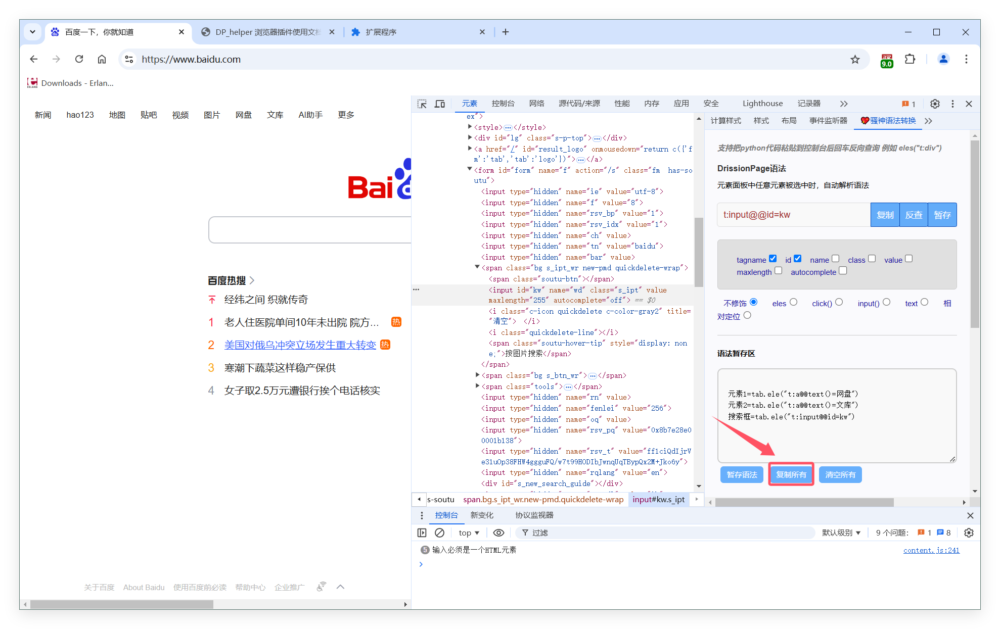 
- 
---
## 🦆 用法四  元素筛选和校验
-   在当前网页 按  F4   键，可以唤起 元素筛选器  可以根据元素的属性  筛选出当前页面的元素，
-   再也不用在ide里调试 排查重复元素了
    
    
- 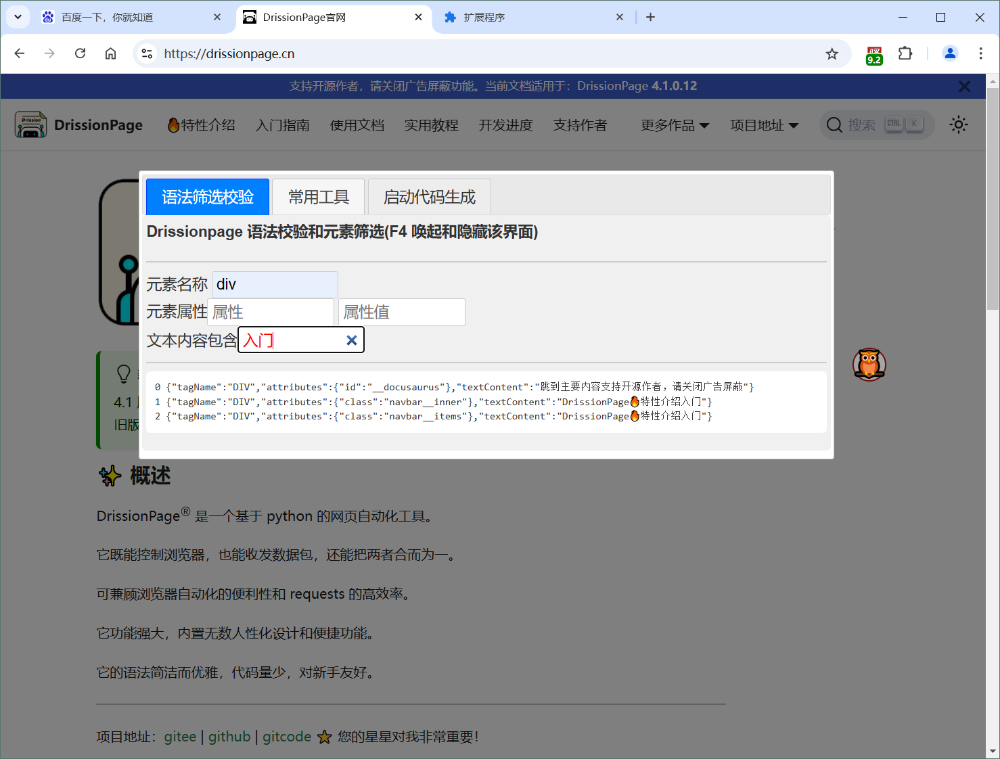 
- 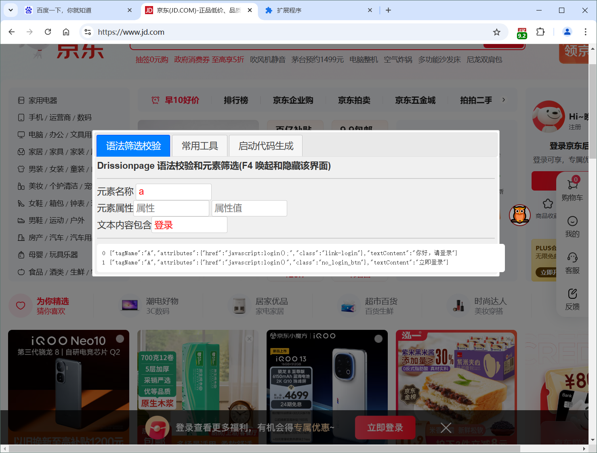 

---
## 🦆 用法五  键鼠轨迹记录器
-   当前网页以独立窗口的模式打开devtool，找到键鼠轨迹记录器，
-   再也不用在ide里调试 排查重复元素了
    
    
- 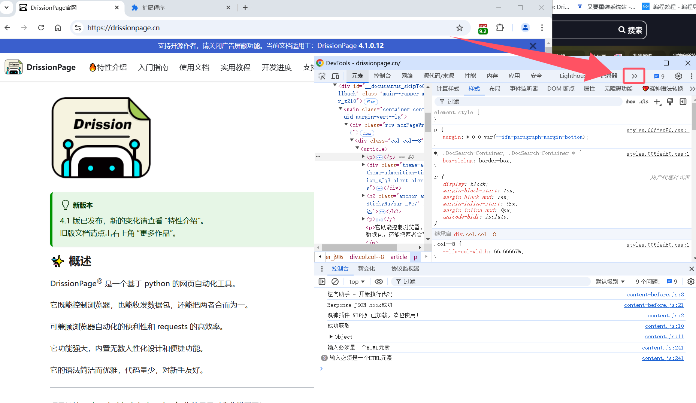 
-  点击 页面某处，自动记录相关键鼠操作
- 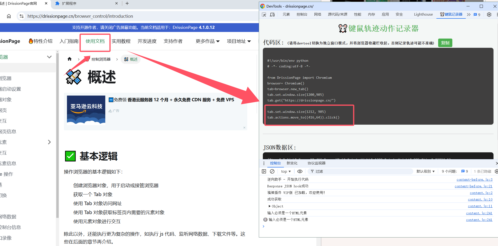 
- 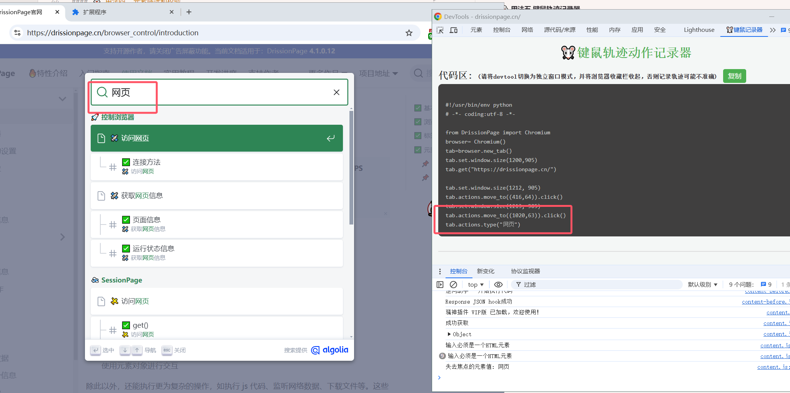 
-  点击复制按钮，一键复制 键鼠轨迹，完美录制刚才所有的操作，完美复刻之前的动作，不用写一句代码，就可以自动化实现之前的操作

- 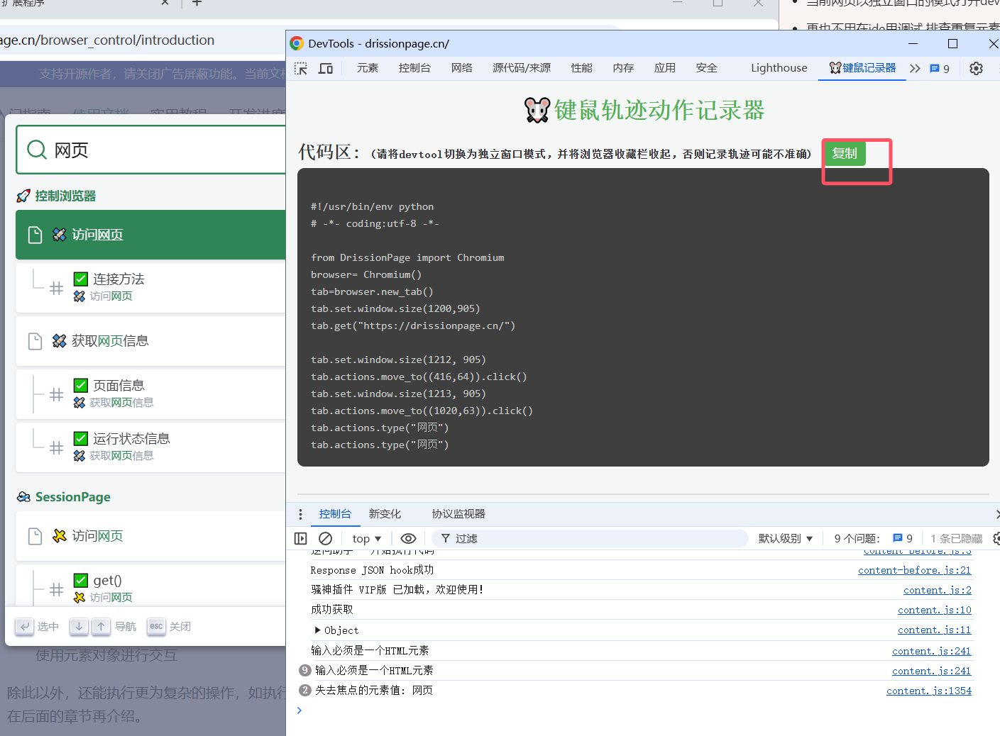 
---

