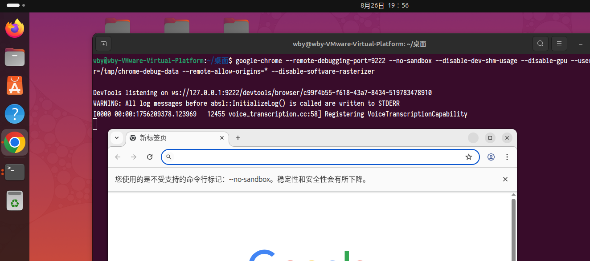
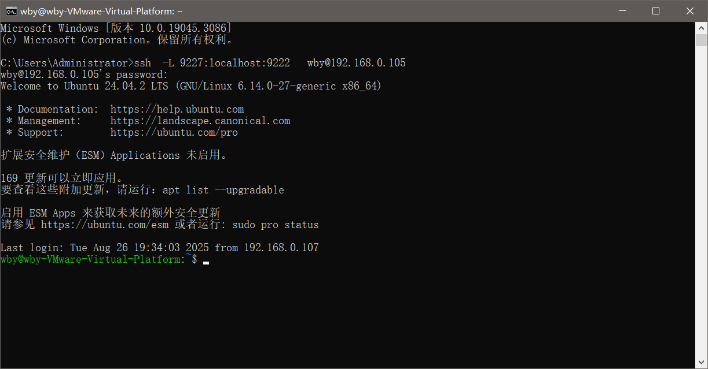

# SSH+DrissionPage 远程自动化操控谷歌浏览器

通过SSH端口转发的方式，在客户机上使用DrissionPage控制远程Linux服务器上的Chrome浏览器。

## 环境准备

### 1. 确保Linux服务器安装SSH服务

首先检查服务器（`user@192.168.0.105`）上是否已安装SSH服务。如果没有安装，需要先进行安装：

```bash
# Ubuntu/Debian系统
sudo apt update
sudo apt install openssh-server

# CentOS/RHEL系统  
sudo yum install openssh-server
# 或者对于较新版本
sudo dnf install openssh-server
```

安装完成后启动SSH服务：

```bash
sudo systemctl start ssh
sudo systemctl enable ssh
```

### 2. 测试SSH连接

在客户机上测试是否能够成功SSH登录到服务器：

```bash
ssh user@192.168.0.105
```

确保能够正常登录后再进行下一步。

### 3. 服务器安装Chrome浏览器

在Linux服务器上安装Google Chrome浏览器：

```bash
# 下载Chrome安装包
wget -q -O - https://dl.google.com/linux/linux_signing_key.pub | sudo apt-key add -
echo "deb [arch=amd64] http://dl.google.com/linux/chrome/deb/ stable main" | sudo tee /etc/apt/sources.list.d/google-chrome.list

# 安装Chrome
sudo apt update
sudo apt install google-chrome-stable
```


### 4. 启动Chrome调试模式

在服务器上通过bash命令行运行以下命令，启动一个带有远程调试功能的Chrome浏览器实例：

```bash
google-chrome --remote-debugging-port=9222 --no-sandbox --disable-dev-shm-usage --disable-gpu --user-data-dir=/tmp/chrome-debug-data --remote-allow-origins=* --disable-software-rasterizer
```

**参数说明：**
- `--remote-debugging-port=9222`：指定调试端口为9222
- `--no-sandbox`：禁用沙箱模式（在某些环境下必需）
- `--disable-dev-shm-usage`：禁用/dev/shm的使用，避免内存不足问题
- `--disable-gpu`：禁用GPU加速，适用于无显示环境
- `--user-data-dir=/tmp/chrome-debug-data`：指定用户数据目录
- `--remote-allow-origins=*`：允许所有来源的远程连接
- `--disable-software-rasterizer`：禁用软件光栅化



### 5. 建立SSH端口转发

在客户机上运行以下命令，建立SSH隧道，将服务器的9222端口转发到客户机的9227端口：

```bash
ssh -L 9227:localhost:9222 user@192.168.0.105
```

**参数说明：**
- `-L`：建立本地端口转发
- `9227:localhost:9222`：将本地9227端口转发到远程主机的localhost:9222
- `user@192.168.0.105`：SSH连接的目标服务器

执行命令后会提示输入服务器用户密码，输入正确密码即可建立连接。



## 使用DrissionPage连接

### 6. 客户机连接远程Chrome

现在您可以在客户机上使用DrissionPage连接到服务器上的Chrome浏览器了。连接端口设置为`9227`：

```python
# 从DrissionPage库导入Chromium类，该库用于控制浏览器进行自动化操作
from DrissionPage import Chromium

# 创建Chromium浏览器实例，并指定调试端口为9227
# 调试端口用于与浏览器进程建立通信，进行自动化控制
browser = Chromium(9227)

# 获取浏览器中最新打开的标签页（通常是当前活动标签页）
tab = browser.latest_tab

# 打印当前标签页的标题
print(tab.title)

# 让当前标签页跳转到百度首页
tab.get('https://www.baidu.com')

# 打印跳转后标签页的URL地址
print(tab.url)
```

## 注意事项

- 保持SSH连接处于活跃状态，断开连接会中断端口转发
- 确保服务器防火墙允许SSH连接（通常是22端口）
- 如果需要后台运行，可以使用`nohup`命令启动Chrome
- 建议在生产环境中配置SSH密钥认证，提高安全性

## 故障排除

如果遇到连接问题，请检查：

1. SSH服务是否正常运行
2. 防火墙设置是否正确
3. Chrome是否成功启动并监听9222端口
4. 端口转发是否建立成功

可以使用以下命令检查端口状态：

```bash
# 检查9222端口是否被占用
netstat -tlnp | grep 9222

# 检查SSH隧道是否建立
netstat -tlnp | grep 9227
```